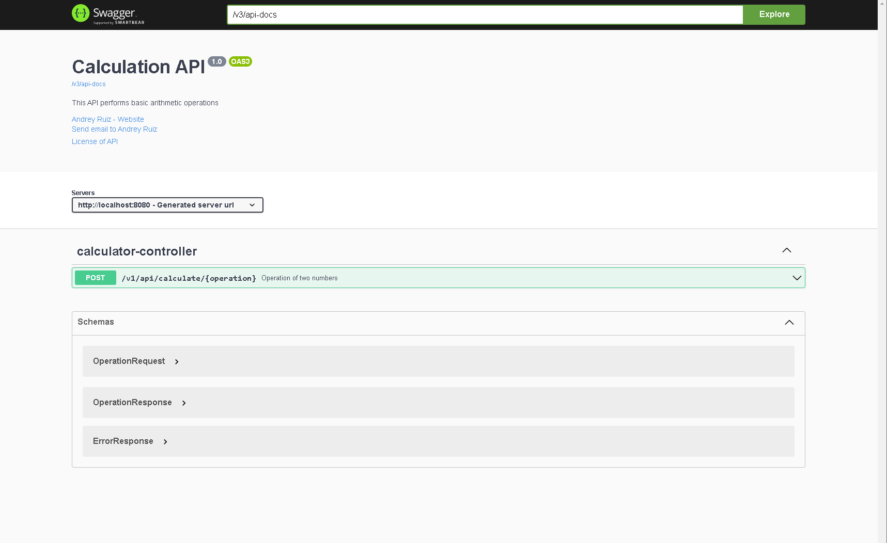
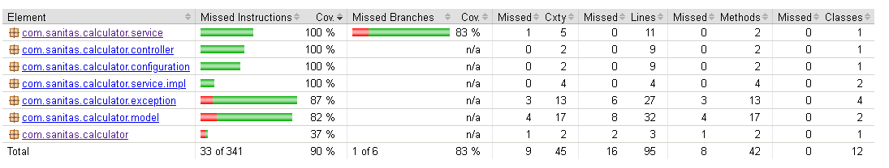
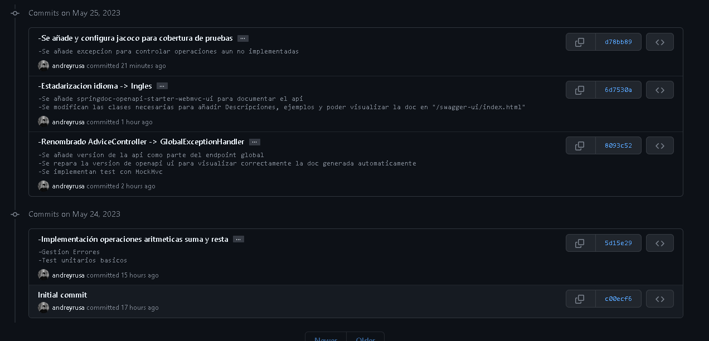

# Spring Boot Calculations Microservice
    Este repositorio contiene un microservicio RESTful construido con Spring Boot que realiza operaciones aritméticas básicas. 
    Por ahora, el servicio puede realizar sumas y restas, pero se ha diseñado para ser fácilmente ampliable a otras operaciones en futuras versiones.

## Estructura del proyecto
    El proyecto sigue una estructura estándar de Maven y utiliza Spring Boot para simplificar la configuración y el arranque. La estructura principal del proyecto es la siguiente:

        -libs: Contiene la libreria tracer-1.0.0.jar
        -src/main/java: Contiene el código fuente de la aplicación, organizado en paquetes por responsabilidad (controladores, servicios, excepciones, etc.).
        -src/test/java: Contiene las pruebas unitarias y de integración de la aplicación.
        -pom.xml: El archivo de configuración de Maven, que incluye las dependencias del proyecto y la configuración del build.

## Dependencias utilizadas
    El proyecto utiliza las siguientes dependencias clave:

        -Spring Boot Starter Web: Para la creación de la aplicación web y la exposición de endpoints REST.
        -Spring Boot Starter Test y JUnit 5: Para las pruebas unitarias y de integración.
        -OpenAPI: Para la generación automática de la documentación de la API REST con el estándar de OpenAPI.
            Se puede acceder en:

```
http://localhost:8080/swagger-ui/index.html
```




## Funcionalidades implementadas y alcance del servicio
    El servicio expone dos endpoints para realizar sumas y restas de dos números:

    POST /v1/api/calculate/sum: Suma dos números. Acepta un cuerpo de solicitud JSON con dos campos, operand1 y operand2, que representan los números a sumar.
    POST /v1/api/calculate/subtract: Resta dos números. Acepta un cuerpo de solicitud JSON con dos campos, operand1 y operand2, que representan los números a restar.
    
    El servicio devuelve un objeto JSON con el resultado de la operación y los detalles de la misma. 
    En caso de error (por ejemplo, si se intenta realizar una operación no válida), el servicio devuelve un código de estado HTTP 501 junto con un mensaje de error descriptivo.
    
    En principio solo se implementan las operaciones de suma y resta. Se ha configurado el servicio de tal forma que se puede añadir más operaciones de forma fácil.
    Para lograr esto se ha creado una interfaz que permite implementar clases específicas de cada Operación. Así, la interfaz Operacion solo define la operación a realizar con los dos campos de entrada de tipo BigDecimal. 
    Ya que solo se ha implementado la suma y resta, se han implementado las clases SubtractOperation y SumOperation que contienen la implementación necesaria para cada caso del método execute().
    
    Para futuros evolutivos se podrán añadir operación de la siguiente manera:
        1. En el constructor de CalculatorService, añadir operations.put("operacion", new NuevaOperation());
        2. "operacion" deberá coincidir con el endpoint de la nueva operación y "NuevaOperation()" será la clase que implementa la interfaz Operacion
    

    En cuanto a la librería Tracer, se ha configurado en el pom.xml para realizar la carga en el repositorio local desde la carpeta /libs del proyecto utilizando mvn clean
    Podemos utilizar el método trace() de dicha librería para lanzar trazas durante la ejecución del servicio. Se ha añadido para trazar la ejecución de los endpoint mostrando los campos que llegan y el resultado del cálculo. 
    Además, se lanzan trazas cuando se obtienen las diferentes excepciones.
    
    Se han codificado los test utilizando junit5. Para medir la cobertura de las pruebas se utiliza el conjunto de bibliotecas JaCoCo. 
    Se ha configurado en el pom.xml con tal de alcanzar el mínimo requerido de cobertura (80%).




    A lo largo de la implementación se ha ido realizando diferentes commit según se iba avanzando. 
    Se ha intentado ser lo más explicativo posible para tener claro el proceso.


## Procedimientos de compilación y ejecución

``` mvn clean ```
``` mvn install ```

Desde el IDE que queramos, podemos ejecutar la aplicacion como una aplicación Spring Boot

## Ejemplos de invocacion

### Suma
``` 
curl -X 'POST' \
  'http://localhost:8080/v1/api/calculate/sum' \
  -H 'accept: application/json' \
  -H 'Content-Type: application/json' \
  -d '{
  "operand1": 5,
  "operand2": 3
}'
```

### Resta
``` 
curl -X 'POST' \
  'http://localhost:8080/v1/api/calculate/subtract' \
  -H 'accept: application/json' \
  -H 'Content-Type: application/json' \
  -d '{
  "operand1": 5,
  "operand2": 3
}'
```